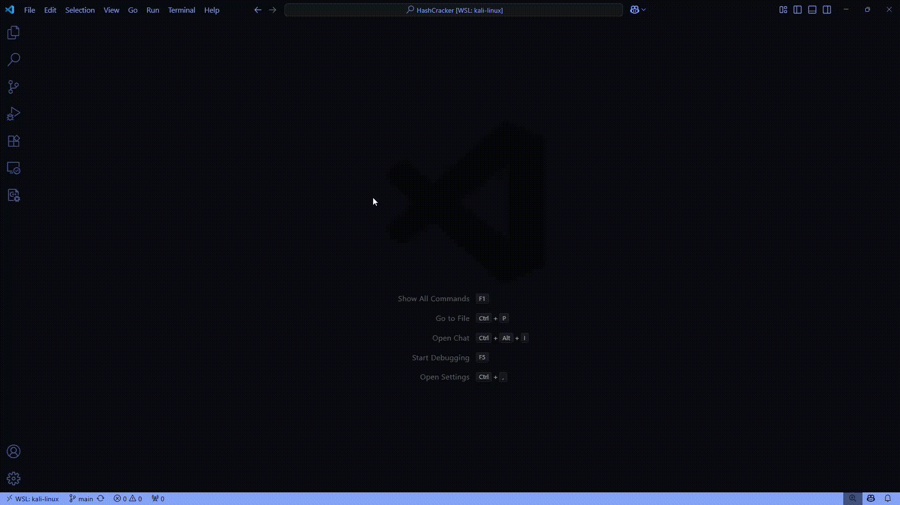

# HashCrack

_🇫🇷 [Version française disponible ici](README_FR.md)_

HashCrack is a simple and efficient command-line tool for cracking password hashes using a rainbow attack. It supports 10 popular hash algorithms including MD5, SHA1, SHA256, SHA512, and more.

> **Note:**  
> This is the **first version** using per-algorithm functions (e.g., `MD5()`, `SHA256()`), which require including each algorithm's header file separately.
> A **future update** will switch to a universal `EVP`-based approach to automatically support **all** OpenSSL algorithms (including SM3, BLAKE2, SHA3, etc.) without adding new code for each.

<div align="center">
  
</div>

## Table of Contents

- 🚀 [Features](#features)
- 🛠️ [Installation](#installation)
- 💻 [Usage](#usage)
- 📋 [Examples](#examples)
- 🔎 [Options](#options)
- 📁 [Project Structure](#project-structure)
- 🙏 [Credits](#credits)
- 📄 [License](#license)

## Features

- Supports 10 hash algorithms including:
  - **MD4, MD5, MD5-SHA1**
  - **RIPEMD160**
  - **SHA1, SHA224, SHA256, SHA384, SHA512**
  - **SHA256-192** (truncated version)
- Fast wordlist-based hash cracking
- Simple and clear CLI interface
- Easily extensible for more algorithms

## Installation

### Prerequisites

- GCC (or compatible C compiler)
- OpenSSL development libraries

### Dependencies

```sh
sudo apt-get install libssl-dev
```

### Clone the repository

```sh
git clone https://github.com/0xMR007/Hashcrack.git
```

### Build

```sh
make
```

## Usage

### Standard Mode

```sh
./hashcrack <ALG_NAME> <HASH> <WORDLIST_PATH>
```

### File Mode

```sh
./hashcrack <ALG_NAME> -f <HASH_FILE> <WORDLIST_PATH>
```

- `<ALG_NAME>`: Name or ID of the hash algorithm (e.g., `md5`, `sha1`, `sha256`, `sha512`, or `0`, `1`, `2`, etc.)
- `<HASH>`: The hash value to crack (must be in hexadecimal format)
- `<HASH_FILE>`: File containing one or multiple hashes (one per line)
- `<WORDLIST_PATH>`: Path to the wordlist file (e.g., `rockyou.txt`)

### Options

```sh
./hashcrack -h, --help    # Show help message
./hashcrack -l, --list    # List all supported algorithms
./hashcrack -f, --file    # Read hashes from a file
```

## Examples

### Standard Mode

```sh
./hashcrack md5 5f4dcc3b5aa765d61d8327deb882cf99 data/rockyou.txt
./hashcrack sha1 5baa61e4c9b93f3f0682250b6cf8331b7ee68fd8 data/rockyou.txt
./hashcrack sha256 a665a45920422f9d417e4867efdc4fb8a04a1f3fff1fa07e998e86f7f7a27ae3 data/rockyou.txt
```

### File Mode

```sh
./hashcrack md5 -f data/hashes.txt data/rockyou.txt
./hashcrack sha1 -f data/hashes.txt data/rockyou.txt
./hashcrack sha256 -f data/hashes.txt data/rockyou.txt
```

### Hash File Format

Hash files should contain one hash per line. Comments (lines starting with `#`) and empty lines are ignored:

```
# Example hash file
5f4dcc3b5aa765d61d8327deb882cf99
7c6a180b36896a0a8c02787eeafb0e4c
# Another hash
6cae0baa6c1c9d4b3b4b4d4f4e4f4e4f
```

## Project Structure

- `src/` : Source code files
- `include/` : Header files
- `data/` : Example wordlists
- `assets/` : Project assets (e.g., preview GIF)

## Credits

- Uses OpenSSL for cryptographic functions

## License

This project is licensed under the MIT License.
